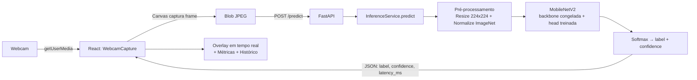
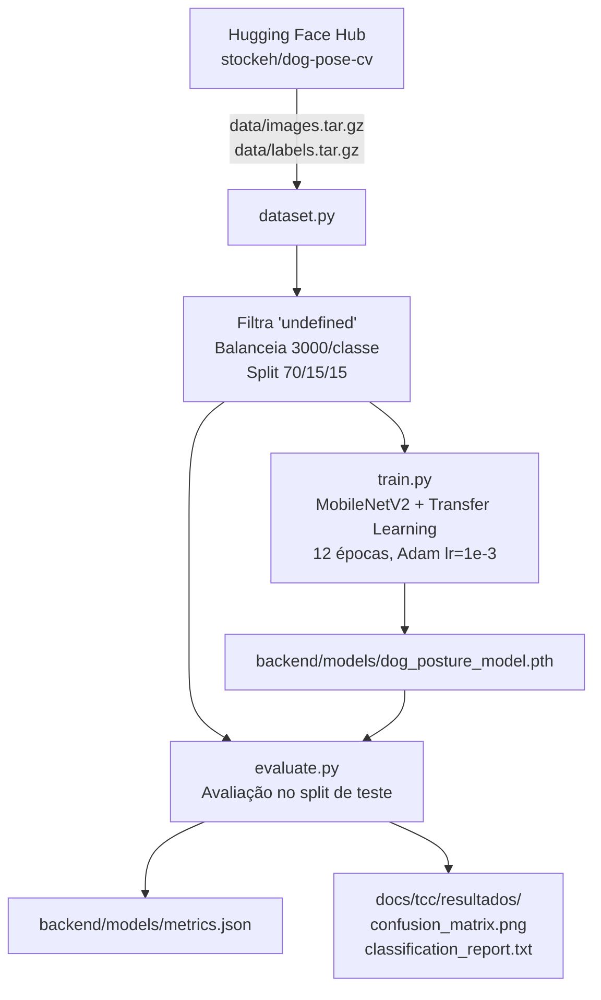

# Diagrama de Arquitetura

## Fluxo de inferência (produção)

## Pipeline de treino (offline, backend/training/)

## Componentes

| Componente | Responsabilidade |
|---|---|
| `frontend/src/components/WebcamCapture.jsx` | Captura de frames da webcam via Canvas |
| `frontend/src/services/api.js` | Comunicação HTTP com o backend (axios) |
| `backend/main.py` | Endpoints REST (`/health`, `/predict`, `/metrics`) |
| `backend/services/inference_service.py` | Orquestra pré-processamento + inferência |
| `backend/services/model_arch.py` | Definição única da arquitetura (usada por treino e produção) |
| `backend/services/preprocessing.py` | Transforms únicos (usados por treino e produção) |
| `backend/training/` | Pipeline offline de download, treino e avaliação |
