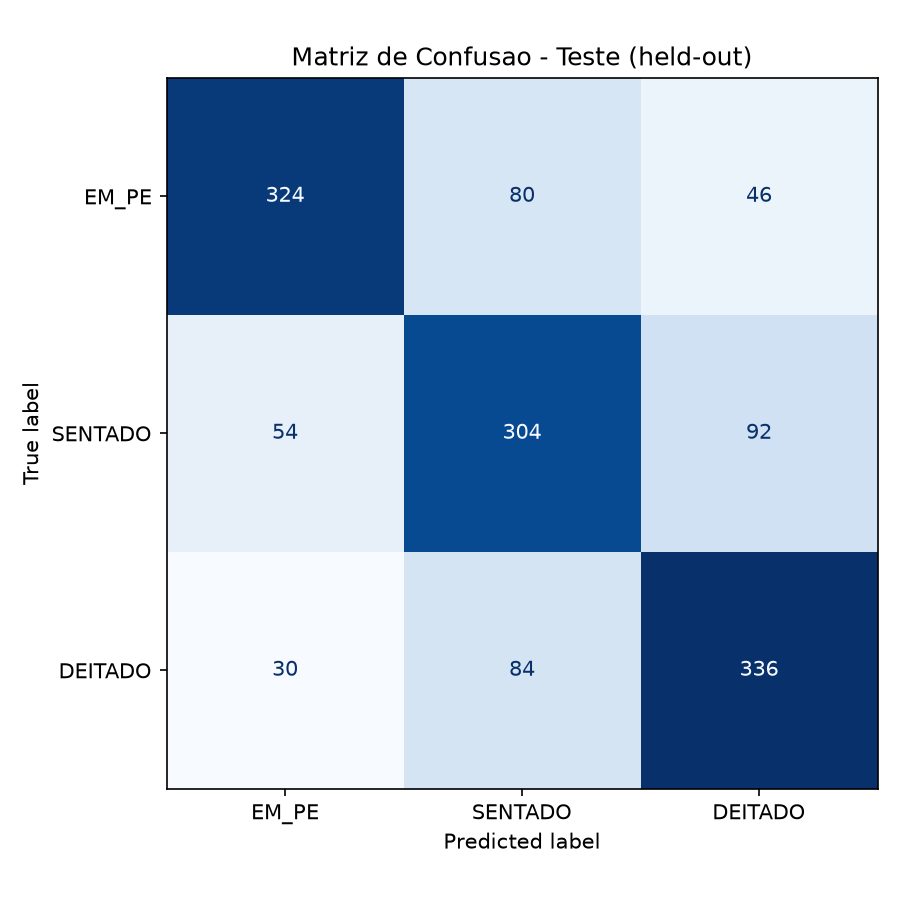

# Resultados

> Gerado por `backend/training/evaluate.py` a partir do checkpoint salvo
> em `backend/models/dog_posture_model.pth` (melhor acurácia de validação
> entre 12 épocas: **71,85%**, na época 9/12). Avaliação feita sobre o
> conjunto de **teste held-out** (1.350 imagens, 450 por classe, nunca
> vistas durante o treino nem a validação) — metodologia completa em
> [`metodologia.md`](metodologia.md). Dados brutos em
> [`../../backend/models/metrics.json`](../../backend/models/metrics.json).

## Resumo geral

| Métrica | Valor |
|---|---|
| Acurácia | **71,41%** |
| F1-score (macro) | 71,49% |
| Confiança média | 70,46% |
| Latência média por imagem | 19,3 ms |
| FPS efetivo | 51,9 |
| Tamanho do conjunto de teste | 1.350 imagens (450/classe) |

## Comparação com as metas do projeto

| Métrica | Meta (README) | Resultado real | Status |
|---|---|---|---|
| Acurácia | ≥ 80% em ambiente controlado | 71,41% | ❌ Não atingida |
| F1-score | Avaliado por classe | Ver tabela abaixo | ✅ Avaliado |
| Latência média | < 150 ms por frame | 19,3 ms | ✅ Atingida (bem abaixo da meta) |
| FPS efetivo | ≥ 5 FPS | 51,9 FPS | ✅ Atingida (a latência de inferência não é o gargalo — o app captura a ~5 FPS por escolha de design, não por limitação do modelo) |
| Confiança média | ≥ 80% | 70,46% | ❌ Não atingida |

**A acurácia e a confiança média ficaram abaixo da meta original.** Isso é
reportado sem ajustes — é o resultado real do modelo treinado com a
metodologia descrita em [`metodologia.md`](metodologia.md).

## Por classe

| Classe | Precisão | Recall | F1-score | Suporte |
|---|---|---|---|---|
| Em Pé | 79,4% | 72,0% | 75,5% | 450 |
| Sentado | 65,0% | 67,6% | 66,2% | 450 |
| Deitado | 70,9% | 74,7% | 72,7% | 450 |

**Sentado** é a classe mais difícil para o modelo (menor precisão e menor
F1), enquanto **Em Pé** é a mais confiável.

## Matriz de confusão



| Real \ Previsto | Em Pé | Sentado | Deitado |
|---|---|---|---|
| **Em Pé** | 324 | 80 | 46 |
| **Sentado** | 54 | 304 | 92 |
| **Deitado** | 30 | 84 | 336 |

A confusão mais frequente é entre **Sentado** e **Deitado** (92 casos de
Sentado classificados como Deitado, 84 casos de Deitado classificados como
Sentado) — faz sentido visualmente: em muitas fotos, um cão sentado com o
tronco baixo ou fotografado de um ângulo específico se parece bastante com
um cão deitado.

## Análise e hipóteses para a diferença em relação à meta

A meta de 80% de acurácia foi definida antes do treino real acontecer, sem
conhecimento de quão difícil seria o dataset. Algumas hipóteses para a
diferença entre a meta e o resultado obtido (candidatas a trabalho
futuro):

1. **Backbone congelada.** Treinar apenas a camada final (Transfer
   Learning "raso") é rápido e barato, mas limita o quanto a rede pode se
   especializar nas texturas específicas de postura canina — a ImageNet
   não tem uma classe "cão sentado" para a rede já ter aprendido
   features especializadas nisso. Descongelar as últimas camadas
   convolucionais (*fine-tuning* parcial) tende a melhorar a acurácia, ao
   custo de mais tempo de treino.
2. **Rótulos ambíguos no próprio dataset.** O dataset original já reporta
   que poses "indistinguíveis" foram descartadas como `undefined`, mas
   mesmo entre as 3 classes usadas, algumas poses são visualmente
   ambíguas (ex: um cão semi-agachado entre sentado e deitado) — o que é
   consistente com a confusão observada na matriz acima.
3. **Poucas épocas de treino.** O treino rodou por apenas 12 épocas em
   CPU. Mais épocas (ou uma taxa de aprendizado com decaimento) poderiam
   extrair mais desempenho da mesma arquitetura congelada.
4. **Ausência de detecção prévia do cão no frame.** Como o projeto ainda
   não implementa um detector de presença do cão, o classificador recebe
   a imagem inteira (que no dataset já vem centrada no cão, mas na webcam
   ao vivo pode ter mais fundo/ruído do que o modelo viu no treino).

## Reprodutibilidade

```bash
cd backend
pip install -r requirements.txt -r training/requirements.txt
python training/train.py
python training/evaluate.py
```
